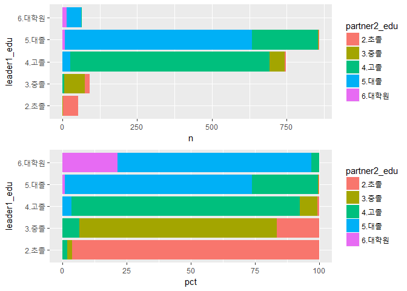
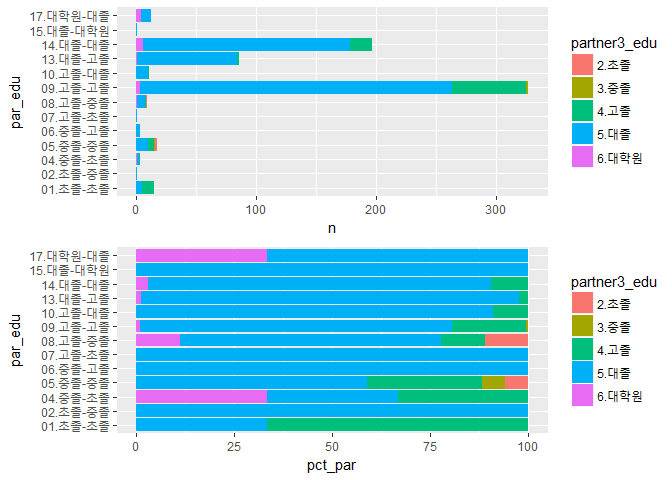
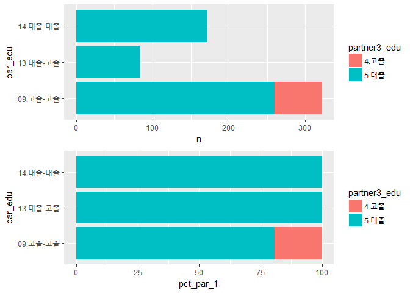
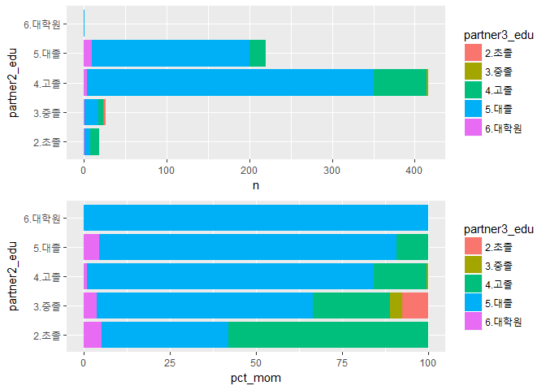
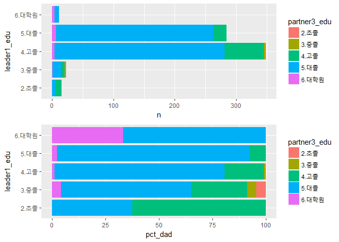

가구원의 최종학력에 대한 상호간의 상관관계
================

1. 요약(초록)
-------------

학벌 주의 사회 대한민국에서 학력에 관해서 가지고 있는 몇 몇개의 고정관념들이 있다. *'남성은 자신보다 낮은 학력의 여성을 배우자로 선호한다'* *'자녀의 학력은 부모의 학력과 상관관계가 크다'* *'자녀의 지적 활동 능력은 어머니의 영향을 많이 받는다'* 등과 같은 고정관념에 대해 사실관계를 확인하고자 한다. 위에서 제시한 3가지 고정관념의 사실 관계를 파악하기 위해 3가지 소주제로 분석을 진행하였다. **1. 남성 가구주와 여성 배우자의 학력 간의 관계** **2. 자녀의 최종 학력과 부모의 최종 학력 간의 관계** **3. 자녀의 최종 학력은 부/모 중 누구의 영향을 많이 받는지** 본 세 가지 주제에 대해서 분석함으로써 기존에 습관적으로 하는 말들의 사실관계를 확인하였다.

**1. 남성 가구주와 여성 배우자의 학력 간의 관계** 에서는 남성은 자신과 비슷한 학력의 여성과 결혼하는 경향성을 발견할 수 있었다. 이를 통해 남성은 자신보다 낮은 학력의 여성과의 결혼을 선호한다는 것에 대해 사실관계를 부정할 수 있다.

**2. 자녀의 최종 학력과 부모의 최종 학력 간의 관계** 에서는 부모의 학력이 높을 수록 자녀의 최종 학력이 높아지는 경향성을 찾을 수 있었다.

**3. 자녀의 최종 학력은 부/모 중 누구의 영향을 많이 받는지**에 관해서는 부/모 모두 거의 동일한 영향을 미침을 알 수 있었다.

2. 분석 주제
------------

"가구원의 최종학력에 대한 상호간의 상관관계" 라는 대주제 하에서 3가지 측면에서의 상관관계를 소주제로 분석하였다. **1. 남성 가구주와 여성 배우자의 최종 학력 간의 관계**

**2. 자녀의 최종 학력과 부모의 최종 학력 간의 관계**

**3. 자녀의 최종 학력은 부/모 중 누구의 영향을 많이 받는지** 위 3개의 소주제로 연구를 진행하였다.

3. 데이터 선정
--------------

"2015\_서울복지실태조사\_데이터.xlsx"을 이용하여 데이터 내부에 있는 가구원 정보와 가구원의 최종학력 정보로 분석하였다.

4. 분석(코드, 표, 그래프, 해석 포함)
------------------------------------

#### **분석 전 패키지 불러오기**

분석에 필요한 패키지를 라이브러리를 로드한다. 분석에 편리함을 더하기 위해서 dplyr, 데이터 시각화를 위해서 ggplot2, 데이터 로드를 위해서 readxl, multiplot을 사용하기 위해서 gridExtra를 각각 로드하였다.

``` r
library(gridExtra)
```

    ## Warning: package 'gridExtra' was built under R version 3.4.4

``` r
library(grid)
library(dplyr)
```

    ## 
    ## Attaching package: 'dplyr'

    ## The following object is masked from 'package:gridExtra':
    ## 
    ##     combine

    ## The following objects are masked from 'package:stats':
    ## 
    ##     filter, lag

    ## The following objects are masked from 'package:base':
    ## 
    ##     intersect, setdiff, setequal, union

``` r
library(ggplot2)
```

    ## Warning: package 'ggplot2' was built under R version 3.4.4

``` r
library(readxl)
```

    ## Warning: package 'readxl' was built under R version 3.4.4

gridExtra 패키지가 오류가 발생하여 multiplot 함수에 대한 코드를 추가하여 사용하는 방식으로 보완하였다.

``` r
# multiplot function #
multiplot <- function(..., plotlist=NULL, file, cols=1, layout=NULL) {
  require(grid)
  plots <- c(list(...), plotlist)
  numPlots = length(plots)
  if (is.null(layout)) {
    layout <- matrix(seq(1, cols * ceiling(numPlots/cols)),
                     ncol = cols, nrow = ceiling(numPlots/cols))
  }
  if (numPlots==1) {
    print(plots[[1]])
  } else {
    grid.newpage()
    pushViewport(viewport(layout = grid.layout(nrow(layout), ncol(layout))))
    for (i in 1:numPlots) {
      matchidx <- as.data.frame(which(layout == i, arr.ind = TRUE))
      print(plots[[i]], vp = viewport(layout.pos.row = matchidx$row,
                                      layout.pos.col = matchidx$col))
    }
  }
}
```

#### **데이터 불러오기**

2015\_서울복지실태조사\_데이터 내부에 있는 가구원 관계 정보와 최종 학력 정보를 이용하고자 본 데이터를 불러들였다.

``` r
data_raw <- read_excel("2015_서울복지실태조사_데이터.xlsx")
```

    ## Warning in read_fun(path = path, sheet_i = sheet, limits = limits, shim =
    ## shim, : Expecting logical in UM1007 / R1007C559: got '媛쒖씤援먯궗'

    ## Warning in read_fun(path = path, sheet_i = sheet, limits = limits, shim =
    ## shim, : Expecting logical in AES2190 / R2190C825: got '�쒓낏�꾩썝�앺솢'

    ## Warning in read_fun(path = path, sheet_i = sheet, limits = limits, shim =
    ## shim, : Expecting logical in PG2194 / R2194C423: got '1�멸�援�'

    ## Warning in read_fun(path = path, sheet_i = sheet, limits = limits, shim =
    ## shim, : Expecting logical in AES2247 / R2247C825: got '�쒓낏�꾩썝�앺솢'

    ## Warning in read_fun(path = path, sheet_i = sheet, limits = limits, shim =
    ## shim, : Expecting logical in AES2257 / R2257C825: got '�쒓낏�꾩썝�앺솢'

``` r
data_copy <- data_raw
```

#### **전처리 작업\_변수 추출 작업**

본 분석에서 사용할 변수들만을 추출하였다. 본 자료에서 분석하고자 하는 것은 '남편(아버지)', '아내(어머니)', 그리고 자녀 간의 최종 학력에 대한 관계를 알고자 하는 것이기 때문에 3인 가구를 가정으로 하고 분석을 진행하였다.

``` r
data <- data_copy %>% 
  select(A1_2_1, A1_2_2, A1_2_3, A1_3_1, A1_3_2, A1_3_3, edu_1, edu_2, edu_3, age_3) 
# A1_2 : 가구원의 관계에 관한 정보
# A1_3 : 가구원 성별
# edu : 가구원의 최종학력에 관한 정보
# age : 가구원의 나이에 관한 정보
```

``` r
table(data$A1_2_1) 
```

    ## 
    ##    1 
    ## 3019

``` r
# 첫 번째 가구원이 모두 가구주임을 확인
```

#### **전처리 작업\_변수명**

``` r
data <- rename(data, 
         leader1 = A1_2_1, # 1: 가구원 / 2 : 배우자 / 3 : 자녀
         partner2 = A1_2_2, 
         partner3 = A1_2_3, 
         leader1_sex = A1_3_1, # sex 1 : 남자 / 2 : 여자
         partner2_sex = A1_3_2, 
         partner3_sex = A1_3_3)
```

#### **전처리 작업\_변수값명 바꾸기**

``` r
data_name_1 <- data.frame(edu_1 = c(1,2,3,4,5,6),
                        leader1_edu = c("1.미취학", "2.초졸", "3.중졸", "4.고졸", "5.대졸", "6.대학원"))
data_name_2 <- data.frame(edu_2 = c(1,2,3,4,5,6),
                        partner2_edu = c("1.미취학", "2.초졸", "3.중졸", "4.고졸", "5.대졸", "6.대학원"))
data_name_3 <- data.frame(edu_3 = c(1,2,3,4,5,6),
                          partner3_edu = c("1.미취학", "2.초졸", "3.중졸", "4.고졸", "5.대졸", "6.대학원"))


data <- data %>%
  left_join(data_name_1, by = "edu_1") %>%
  left_join(data_name_2, by = "edu_2") %>%
  left_join(data_name_3, by = "edu_3") %>%
  select(leader1, partner2, partner3, leader1_sex, partner2_sex, partner3_sex, leader1_edu, partner2_edu, partner3_edu, age_3)
```

#### **분석 1\_남성 가구주와 여성 배우자의 최종 학력 간의 관계**

본 분석의 용이함을 위해 가구원1 이 남성 가구주(남편)임과 동시에 가구원2가 배우자(아내)인 경우 만을 추출하여 분석하였다.

``` r
# 독립 변수 : 남성 가구원의 최종 학력 
# 종속 변수 : 배우자의 최종 학력
# 집단 : 가구주가 남성이면서 가구원2가 배우자인 집단
data_male <- data %>%
  filter(leader1_sex == 1 & partner2 == 2) %>%
  filter(!is.na(leader1_edu) & !is.na(partner2_edu)) %>% # 결측치 제ㄱ
  group_by(leader1_edu, partner2_edu) %>%
  summarise(n = n()) %>%
  mutate(pct = (n/sum(n)) * 100) %>%
  arrange(desc(leader1_edu))
```

    ## Warning: package 'bindrcpp' was built under R version 3.4.4

``` r
data_edu <- data_male
```

graph 1은 대한민국 남성 가구주들의 최종 학력과 그에 따른 배우자들의 최종학력의 빈도를 나타낸 그래프이다. graph 2은 graph 1의 내용을 비율로 나타낸 그래프이다.

``` r
# graph 1 #
g1 <- ggplot(data = data_edu, aes(x = leader1_edu, y= n, fill = partner2_edu)) + 
  geom_col() +
  coord_flip()


# graph 2 #
g2 <- ggplot(data = data_edu, aes(x = leader1_edu, y= pct, fill = partner2_edu)) +
  geom_col() +
  coord_flip()


multiplot(g1, g2, cols = 1) # 그래프 합치기
```



남편의 학력에 따라 배우자의 학력 비율을 보았을 때 대부분 남성과 여성의 최종 학력 수준이 비슷한 수준인 것을 알 수 있다. 특히 5. 대졸과 4. 고졸 부분을 통해 남성보다 낮은 최종 학력의 배우자 비율보다 남성과 동일한 최종 학력의 배우자 비율이 월등히 높다는 사실을 통해 이르 추론할 수 있다. 즉, 기존에 가지고 있던 고정관념인 *'남성은 자신보다 낮은 학력의 여성을 배우자로 선호한다'* 것은 잘못된 고정관념임을 알 수 있으며 *'남성은 자신과 비슷한 수준의 학력의 여성을 배우자로 선호한다'* 라는 새로운 결론을 도출해낼 수 있다.

#### **분석 2\_자녀의 최종 학력과 부모의 최종 학력 간의 관계**

본 분석의 용이함을 위해 가구원 1이 남편이고 가구원 2가 아내, 가구원 3이 자녀인 경우만을 추출하여 분석을 진행하였다. 또한 가구원 3이 학업을 지속하고 있어 그것이 실질적인 의미의 최종학력이 아닐 수 있으므로 자녀의 나이를 만 19세 이상으로 하여 주로 대학교 교육의 여부를 기준으로 하였다.

``` r
# 독립 변수 : 부모님의 최종 학력 
# 종속 변수 : 자녀의 최종 학력
# 집단 : 남성 가구주이면서 가구원2가 배우자인 가구원 3이 만 19세 이상의 자녀를 둔 가구 
data_rel <- data %>%
  filter(leader1_sex == 1 & partner2 == 2 & partner3 == 3) %>%
  filter(!is.na(leader1_edu) & !is.na(partner2_edu) & !is.na(partner3_edu)) %>% # 결측치 제거
  filter(age_3 >= 19) %>%
  mutate(par_edu = ifelse(leader1_edu == "2.초졸" & partner2_edu == "2.초졸", "01.초졸-초졸",
                          ifelse(leader1_edu == "2.초졸" & partner2_edu == "3.중졸", "02.초졸-중졸",
                                 ifelse(leader1_edu == "2.초졸" & partner2_edu == "4.고졸", "03.초졸-고졸",
                                        ifelse(leader1_edu == "3.중졸" & partner2_edu == "2.초졸", "04.중졸-초졸",
                                               ifelse(leader1_edu == "3.중졸" & partner2_edu == "3.중졸", "05.중졸-중졸",
                                                      ifelse(leader1_edu == "3.중졸" & partner2_edu == "4.고졸", "06.중졸-고졸",
                                                             ifelse(leader1_edu == "4.고졸" & partner2_edu == "2.초졸", "07.고졸-초졸",
                                                                    ifelse(leader1_edu == "4.고졸" & partner2_edu == "3.중졸", "08.고졸-중졸",
                                                                           ifelse(leader1_edu == "4.고졸" & partner2_edu == "4.고졸", "09.고졸-고졸",
                                                                                  ifelse(leader1_edu == "4.고졸" & partner2_edu == "5.대졸", "10.고졸-대졸",
                                                                                         ifelse(leader1_edu == "5.대졸" & partner2_edu == "2.초졸", "11.대졸-초졸",
                                                                                                ifelse(leader1_edu == "5.대졸" & partner2_edu == "3.중졸", "12.대졸-중졸",
                                                                                                       ifelse(leader1_edu == "5.대졸" & partner2_edu == "4.고졸", "13.대졸-고졸",
                                                                                                              ifelse(leader1_edu == "5.대졸" & partner2_edu == "5.대졸", "14.대졸-대졸",
                                                                                                                     ifelse(leader1_edu == "5.대졸" & partner2_edu == "6.대학원", "15.대졸-대학원",
                                                                                                                            ifelse(leader1_edu == "6.대학원" & partner2_edu == "4.고졸", "16.대학원-고졸",
                                                                                                                                   ifelse(leader1_edu == "6.대학원" & partner2_edu == "5.대졸", "17.대학원-대졸",
                                                                                                                                          ifelse(leader1_edu == "6.대학원" & partner2_edu == "6.대학원", "18.대학원-대학원","NULL"))))))))))))))))))) %>% # 부모의 최종 학력을 합친 변수 만들기
  group_by(par_edu, partner3_edu) %>%
  summarise(n = n()) %>%
  mutate(pct_par = (n/sum(n)) * 100) %>%
  arrange(desc(par_edu))

data_edu_rel <- data_rel
```

graph 3은 부모의 최종 학력과 그에 따른 자녀의 만 19세 이상 자녀의 최종 학력의 빈도를 나타낸 그래프이며 graph 4는 graph 3의 내용을 비율로 나타낸 그래프이다.

``` r
# graph 3 #
g3 <- ggplot(data = data_edu_rel, aes(x = par_edu, y= n, fill = partner3_edu)) + 
  geom_col() + 
  coord_flip()

# graph 4 #
g4 <- ggplot(data = data_edu_rel, aes(x = par_edu, y= pct_par, fill = partner3_edu)) +
  geom_col() +
  coord_flip()

multiplot(g3, g4, cols = 1)
```



위 그래프를 통해 부모의 최종학력에 따른 자녀의 최종학력의 빈도는 알 수 있지만 빈도가 낮아서 비율로 분석하는 것이 의미가 없는 변수들이 상당수 존재하여 변수를 추출하여 분석할 필요성을 느꼈다.

#### **분석 2\_1자녀의 최종 학력과 부모의 최종 학력 간의 관계\_신뢰성 확보를 위한 변수 축약**

``` r
# 독립 변수 : 부모님의 최종 학력 
# 종속 변수 : 자녀의 최종 학력 
# 변수 : 빈도가 20이상인 변수만 추출
data_rel_1 <- data_rel %>%
  filter(n >= 20) %>%
  mutate(pct_par_1 = (n/sum(n)) * 100) %>%
  arrange(desc(par_edu))
```

빈도 수가 낮아 분석의 의미가 없는 변수를 제외하여 상관관계의 신뢰성을 높이고자 빈도가 20 이상인 변수들만 재추출하였다.

``` r
# graph 5 #
g5 <- ggplot(data = data_rel_1, aes(x = par_edu, y= n, fill = partner3_edu)) + 
  geom_col() +
  coord_flip()

# graph 6 #
g6 <- ggplot(data = data_rel_1, aes(x = par_edu, y= pct_par_1, fill = partner3_edu)) +
  geom_col() +
  coord_flip()

multiplot(g5, g6, cols = 1)  # 그래프 합치기
```



부모 두 사람의 학력이 대졸에 가까울 수록 자녀의 학력 비율도 대졸에 가까워진다는 점에서 부모의 학력이 높을 수록 자녀의 최종 학력이 높아지는 경향성을 찾을 수 있었다. 즉 *'자녀의 학력은 부모의 학력과 상관관계가 크다'* 관념은 근거 있는 사회적 통념이라고 할 수 있다.

#### **분석 3 자녀의 최종 학력은 부/모 중 누구의 영향을 많이 받는지**

#### **분석 3\_1 어머니의 최종학력과 자녀의 최종학력 간의 상관관계**

본 분석의 용이함을 위해 분석2와 동일하게 변수를 추출하여 진행하였다.

``` r
# 독립 변수 : 어머니의 최종 학력 
# 종속 변수 : 자녀들의 최종 학력
# 집단 : 남성 가구주이면서 가구원2가 배우자인 가구원 3이 만 19세 이상의 자녀를 둔 가구
data_mom <- data %>%
  filter(leader1_sex == 1 & partner2 == 2 & partner3 == 3 & age_3 >= 19) %>%
  group_by(partner2_edu, partner3_edu) %>%
  summarise(n = n()) %>%
  mutate(pct_mom = (n/sum(n)) * 100) %>%
  arrange(desc(partner2_edu))

data_edu_mom <- data_mom
```

graph 7은 어미니의 최종 학력과 그에 따른 자녀의 만 19세 이상 자녀의 최종 학력의 빈도를 나타낸 그래프이며 graph 8는 graph 7의 내용을 비율로 나타낸 그래프이다.

``` r
# graph 7 #
g7 <- ggplot(data = data_edu_mom, aes(x = partner2_edu, y= n, fill = partner3_edu)) + 
  geom_col() +
  coord_flip()


# graph 8 #
g8 <- ggplot(data = data_edu_mom, aes(x = partner2_edu, y= pct_mom, fill = partner3_edu)) +
  geom_col() +
  coord_flip()

multiplot(g7, g8, cols = 1)
```



위 그래프를 통해 어머니의 최종학력에 따른 자녀의 최종학력의 빈도는 알 수 있지만 빈도가 낮아서 비율로 분석하는 것이 의미가 없는 변수들이 상당수 존재하여 변수를 추출하여 분석할 필요성을 느꼈다. 또한 본 그래프의 분석은 아버지의 최종학력과 자녀의 최종학력 간의 상관관계에 관한 그래프와의 비교분석을 통해서 *'자녀의 지적 활동 능력은 어머니의 영향을 많이 받는다'*에 관한사실관계를 도출 할 수 있다.

#### **분석 3\_2 아버지의 최종학력과 자녀의 최종학력 간의 상관관계**

본 분석의 용이함을 위해 분석2와 동일하게 변수를 추출하여 진행하였다.

``` r
# 독립 변수 : 아버지의 최종 학력 
# 종속 변수 : 자녀들의 최종 학력
data_dad <- data %>%
  filter(leader1_sex == 1 & partner2 == 2 & partner3 == 3 & age_3 >= 19) %>%
  group_by(leader1_edu, partner3_edu) %>%
  summarise(n = n()) %>%
  mutate(pct_dad = (n/sum(n)) * 100) %>%
  arrange(desc(leader1_edu))


data_edu_dad <- data_dad
```

graph 9은 아버지의 최종 학력과 그에 따른 자녀의 만 19세 이상 자녀의 최종 학력의 빈도를 나타낸 그래프이며 graph 10는 graph 9의 내용을 비율로 나타낸 그래프이다.

``` r
# graph 9 #
g9 <- ggplot(data = data_edu_dad, aes(x = leader1_edu, y = n, fill = partner3_edu)) + 
  geom_col() +
  coord_flip()

# graph 10 #
g10 <- ggplot(data = data_edu_dad, aes(x = leader1_edu, y= pct_dad, fill = partner3_edu)) +
  geom_col() +
  coord_flip()

multiplot(g9, g10, cols = 1) # 그래프 합쳐놓기
```



위 그래프를 통해 아버지의 최종학력에 따른 자녀의 최종학력의 빈도는 알 수 있지만 빈도가 낮아서 비율로 분석하는 것이 의미가 없는 변수들이 상당수 존재하여 변수를 추출하여 분석할 필요성을 느꼈다. 또한 본 그래프의 분석은 아버지의 최종학력과 자녀의 최종학력 간의 상관관계에 관한 그래프와의 비교분석을 통해서 *'자녀의 지적 활동 능력은 어머니의 영향을 많이 받는다'*에 관한사실관계를 도출 할 수 있다.

#### **분석 3\_3 자녀의 최종 학력은 부/모 중 누구의 영향을 많이 받는지\_신뢰성 확보를 위한 변수 축약**

위 부/모 각각의 최종학력이 자녀의 최종학력이 자녀의 최종학력 간의 상관관계 그래프에서 빈도가 낮아 분석의 의미가 없는 변수를 제외하고 추출하여 아버지가 미치는 영향력과 어머니가 미치는 영향력을 비교 분석한다.

``` r
# 아버지와 자녀의 최종학력 간의 상관관계
# 변수 : 빈도가 20이상인 변수만 추출
data_edu_new <- data_dad %>%
  filter(n>=20) %>%
  mutate(pct_new = n/sum(n)*100)

# 어머니와 자녀의 최종학력 간의 상관관계
# 변수 : 빈도가 20이상인 변수만 추출
data_edu_new_1 <- data_mom %>%
  filter(n>=20) %>%
  mutate(pct_new_1 = n/sum(n)*100)
```

graph 11은 빈도가 낮은 변수를 제거한 아버지의 최종학력과 자녀의 최종학력의 비율을 나타낸 그래프이며 graph 12는 빈도가 낮은 변수를 제거한 어머니의 최종학력과 자녀의 최종학력의 비율을 나타낸 그래프이다.

``` r
# graph 11 #
g11 <- ggplot(data = data_edu_new, aes(x = leader1_edu, y= pct_new, fill = partner3_edu)) +
  geom_col() +
  coord_flip()
# graph 12 #
g12 <- ggplot(data = data_edu_new_1, aes(x = partner2_edu, y= pct_new_1, fill = partner3_edu)) +
  geom_col() +
  coord_flip()

multiplot(g11, g12, cols = 1) # 그래프 합쳐놓기
```


아버지의 최종학력이 높을 수록 자녀의 최종학력이 높은 것에 관한 비율과 어머니의 최종학력이 높을 수록 자녀의 최종학력이 높은 것에 관한 비율이 거의 유사하므로 부/모는 자녀의 최종학력에 거의 동일하게 영향을 미침을 알 수 있다. 즉 지적 활동 능력의 척도를 최종 학력으로 놓았을 때 *'자녀의 지적 활동 능력은 어머니의 영향을 많이 받는다'*라는 고정관념은 잘못된 관념이며 *'자녀의 지적 활동 능력은 부모 모두 동일하게 영향을 끼친다'*는 새로운 결론을 도출할 수 있다.

5. 결론
-------

**1. 남성 가구주와 여성 배우자의 학력 간의 관계** 라는 주제에서 남성 가구주의 최종학력과 여성 배우자의 최종학력이 거의 유사하다는 결론을 통해 *'남성은 자신보다 낮은 학력의 여성을 배우자로 선호한다'*은 잘못된 관념이며 *'남성은 자신과 비슷한 수준의 학력의 여성을 배우자로 선호한다'* 라는 새로운 결론을 도출하였다.

**2. 자녀의 최종 학력과 부모의 최종 학력 간의 관계**라는 주제에서 부모의 최종학력이 높을 수록 자녀의 최종학력이 높다는 경향성을 통해 *'자녀의 학력은 부모의 학력과 상관관계가 크다'* 라는 관념은 근거있는 사회적 통념임을 알 수 있다.

**3. 자녀의 최종 학력은 부/모 중 누구의 영향을 많이 받는지**라는 주제에서 부/모의 최종학력이 높을 수록 자녀의 최종학력이 높은 비율이 거의 동일하다는 것을 통해 *'자녀의 지적 활동 능력은 어머니의 영향을 많이 받는다'* 라는 관념은 잘못된 통념이며 *'자녀의 지적 활동 능력은 부모로부터 동일하게 영향을 많이 받는다'*라는 새로운 결론을 도출하였다.

6. 한계점 및 비판점
-------------------

1.  연구 대상을 추출할 때 데이터의 구조와 가공상의 편의 때문에 변수 추출과정에서 버린 연구 대상이 존했다. 그들로 인해 다른 결론이 도출되었을 수도 있었다.
2.  가구의 형태는 다양하고 자녀의 수에 따라 자녀에게 투자할 수 있는 여력이 달라 최종학력에 영향을 미칠 수 있었을텐데 데이터 가공 상의 편의 문제로 인해서 3인가구를 가정하고 가구원 3에 자녀로 등록되어있는 만 19세 이상의 자녀에 대해서만 연구를 진행하여 이 부분에서는 연구 대상 집단이 작아져서 더 자세한 분석이 이루어지지 못해 아쉬웠다.
3.  주제 2와 3에서 부모의 최종학력과 자녀의 최종학력에 영향을 미치는 다른 요소를 고려해보지 않았다.
4.  주제 3에서 지적 활동 능력을 입증하는 수단으로써 최종학력을 사용한 것이 아쉽다. 지적 활동 능력과 최종학력에 상관관계가 약간은 있지만 하지만 최종학력이 낮다고 해서 지적 활동 능력이 낮다고 할 순 없기 때문이다

7. 마무리
---------

우리는 이러한 결론을 통해 기존의 잘못된 관념이 투영된 혹은 근거있는 사회적 통념이 투영되지 않은 말들의 언급에 대해 재고해볼 필요가 있다. "여자는 남자보다 뛰어나면 남자가 싫어해" 라는 말에 우리는 남성들은 자신만큼 뛰어난 여성을 선호한다는 입증된 사실 관계를 통해 비판한다. 부진한 성적 보여주는 자녀에게 "누구 닮아서 그래!" 라고 혼내는 부모님은 *'자녀의 지적 활동 능력은 어머니의 영향을 많이 받는다'*라는 사실관계가 입증된 통념을 통해 말은 삼가할 필요를 느끼길 바란다. 성차별적 가치관에 사로잡혀 공부를 못하는 손자 손녀를 보고 "늬 엄마 닮아서 그래!" 라고 말을 하고 있으신 어르신들 역시 *'자녀의 지적 활동 능력은 부모로부터 동일하게 영향을 많이 받는다'*라는 관념을 통해 아버지의 중요함 역시도 잊지않을 필요를 느끼길 바라며 본 연구를 마친다.
